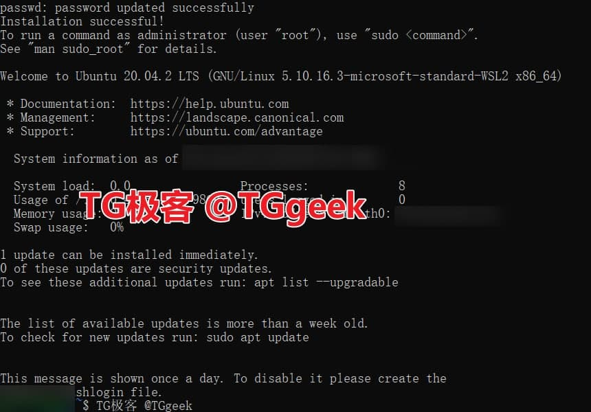
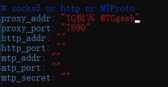

# wsl ubuntu 20.04

Win10 利用 WSL 版本 Ubuntu 安装 PagerMaid 教程（新手向/超详细教学）

感谢：[TGgeek | TG极客](https://t.me/TGgeek/894)

# Ubuntu 下载及配置

在 Windows 商店搜索 Ubuntu 并下载，如下图所示。


下载完成后可以查看到 Ubuntu 版本为 `2004.2021.222.0` 。

?> 本条内容参考 [Win10 WSL 安装指导](https://docs.microsoft.com/en-us/windows/wsl/install-win10) 

右键开始菜单，选择 `以管理员身份打开 Powershell` ，输入 `wsl --install` 命令，等待 Windows subsystem for Linux 安装完成。

!> 安装完成后需要重启电脑

重启后打开 Ubuntu 会提示正在安装，需要等待几分钟，等待安装完成，根据提示输入 UNIX 用户名和管理密码（需妥善保存），随后等待程序配置完成，
会提示成功，如下图所示。



## Clash for Windows

首先在 `Clash for Windows` 中打开 `Allow Lan` 功能，再使用 `UWP Loopback` 勾选 `Ubuntu` 走代理。

## Clash .NET

在 `Clash .NET` 主界面右方打开 `允许局域网` 功能，再右键托盘图标，选择 `UWP 回环` -> `启动助手`，勾选 `Ubuntu` -> `sava changes`

# 查询 WSL 中 DNS 服务器 IP

```bash
cat /etc/resolv.conf
```

记录下 `nameserver` 后的地址，形如：`123.45.678.9`

# 安装 pip、git

```bash
sudo apt update
sudo apt install python3-pip git -y
sudo apt install --only-upgrade git -y
```

完成后检查 pip 版本 `pip3 --version` ，git 版本 `git --version`

## 配置 pip

将 pip 的源设置为清华大学开源软件镜像站的源

```bash
pip3 config set global.index-url https://pypi.tuna.tsinghua.edu.cn/simple
```

## 配置 git

将 git 配置为走代理

```bash
git config --global http.proxy 'socks5://123.45.678.9:7890'
git config --global https.proxy 'socks5://123.45.678.9:7890'
```

# 拉取项目

本项目托管在 `github` ，从仓库直接拉取项目

```bash
git clone https://github.com/Xtao-Labs/PagerMaid-Modify.git pagermaid && cd pagermaid
```

# 安装软件包

## imagemagick

?> 此软件包用于处理图片，如您没有图片处理需求，您可以无需安装此软件包。

```bash
sudo apt install imagemagick -y
```

## neofetch

?> 此软件包用于显示系统信息，如您没有显示系统信息需求，您可以无需安装此软件包。

```bash
sudo apt install neofetch -y
```

## zbar

?> 此软件包用于处理二维码信息，如您没有处理二维码信息需求，您可以无需安装此软件包。

```bash
sudo apt install libzbar-dev -y
```

## tesseract

?> 此软件包用于图片光学字符识别，如你没有处理此方面的需求，你可以无需安装此软件包。

## 最大化安装

```bash
sudo apt install tesseract-ocr tesseract-ocr-all -y
```

## 最小化安装

```bash
sudo apt install tesseract-ocr tesseract-ocr-eng tesseract-ocr-chi-sim -y
```

## Redis

?> 此软件包用于记录信息，以方便软件重启后仍然可以进行上一次未完成的任务，你也可以无需安装此软件包。

```bash
sudo apt install redis-server -y
```

# 安装依赖包

```bash
pip3 install -r requirements.txt
```

# 修改配置文件

将配置 `config.gen.yml` 文件复制一份并且命名为 `config.yml`

```bash
cp config.gen.yml config.yml
vi config.yml
```

> 按 i 进入编辑模式

然后去 [telegram 官网](https://my.telegram.org/) 生成 api 填入配置文件内，
我们只需要复制 `api id` 和 `api_hash` 值 填入 `api_key` 和 `api_hash` 。

再按方向下键，找到 `Socks5 or http or MTProto` 一栏，如下图所示位置，其中 `proxy_addr` 设置为 WSL 中 DNS 服务器 IP; 
`proxy_port` 设置为 `7890`（这是 Clash 的默认端口，如果您没有修改过那直接复制即可）。



> 按下 esc 输入 shift 加冒号，输入 wq 保存退出

!> 千万不要删除引号

# 登录账号

```bash
python3 -m pagermaid
```

此步需要填入完整的电话号码（eg：`+12569986522`）然后 tg 会发给你的其他客户端发送验证码，填入验证码后，回车，如有两步验证密码，则再输入两步验证密码即可。


在 Telegram 内任意对话界面输入 -help 会显示 PagerMaid 命令列表，如图5所示。


## 停止运行

```bash
ctrl + c
```

## 重新使用 PagerMaid

打开 `Ubuntu` 后，输入：

```bash
cd pagermaid && python3 -m pagermaid
```

完全按照此教程操作的话直接运行以上命令即可。如果安装目录不一样，需要自行修改到对应的目录。

!> 请注意保护好您已登录的 `pagermaid.session` 。此文件可以进行账号所有操作，请不要分享给他人使用。

# 进程守护

暂无
